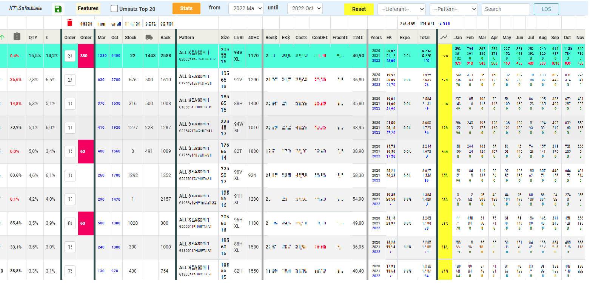

<h2 align="left">Stock Management</h2>

<h4 align="left">A web app implemented using Blazor and .NET 5</h4>

<h6 align="left">This project aims to calculate company's inventory needs throughout the year and determine the time and the amount of new production.
By looking at the monthly sales in previous year the application tries to calculate estimated sales. It lists the purchase prices for each item in inventory and finds  
the average purchase prices for the items in warehouse. Application uses the variables from the users to do cost calculation and reaches the end price for items.
</h6>

 

